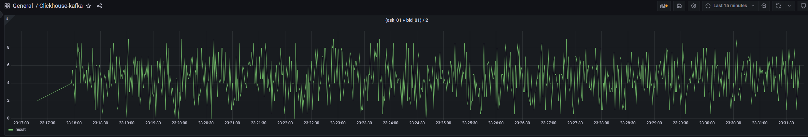
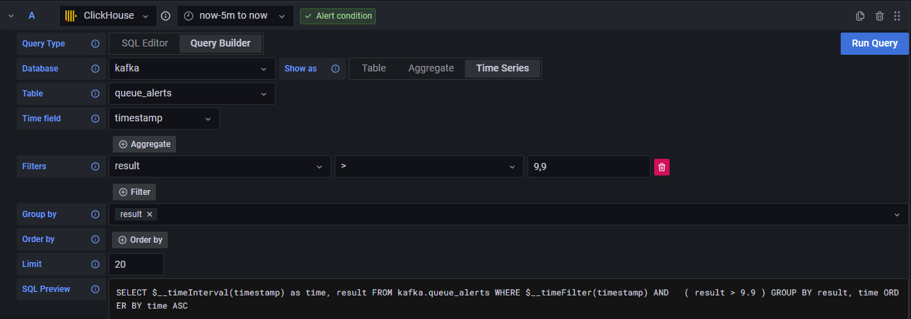

Test piplines
========
Structure catalog
```
├── LICENSE.md
├── README.md
├── app
│   ├── Dockerfile
│   ├── kafkaspam
│   │   ├── __init__.py
│   │   ├── __main__.py
│   │   ├── main.py
│   │   └── utils.py
│   ├── requirements.txt
│   ├── setup.cfg
│   └── setup.py
├── clickhouse
│   ├── config
│   │   └── allow_experimental_map_type.xml
│   └── initsql
│       ├── create_table_queue_kafka.sql
│       ├── create_table_queue_kafka_from_topic.sql
│       ├── create_view_queue_alerts.sql
│       └── create_view_queue_kafka_view.sql
├── docker-compose.yml
├── grafana
│   ├── alerting
│   │   └── clickhouse.yml
│   ├── dashboards
│   │   ├── clickhouse_kafka.json
│   │   └── dashboard.yml
│   └── datasources
│       └── clickhouse.yml
├── grafana_alert.png
└── grafana_dashboard.png
```

## Install

### Change .env:
```
ENV=home

#APP
APP_POLLING_INTERVAL=0.001
APP_RANGE_DATA=51
APP_KAFKA_HOST=kafka:9092
# change click_initdb/@.sql
APP_KAFKA_TOPIC=ch-topic

#KAFKA
KAFKA_VERSION=6.1.1
#CH
CLICKHOUSE_VERSION=21.8.14
CLICKHOUSE_DB=kafka
CLICKHOUSE_USER=kafka
CLICKHOUSE_PASSWORD=kafka

#Grafana
GRAFANA_VERSION=9.3.2
GRAFANA_ADMIN_USER=grafana
GRAFANA_ADMIN__PASSWORD=grafana
```


### Clone this repository on your Docker host, cd into test directory and run compose up:

```
git clone https://github.com/Armadik/for-the-test-task
cd for-the-test-task
docker-compose up -d
```

## Access Grafana

Login 'GRAFANA_ADMIN_USER/GRAFANA_ADMIN__PASSWORD'(default grafana/grafana)

http://localhost:3000/

# Create alert grafana


```sql
SELECT $__timeInterval(timestamp) as time, result FROM kafka.queue_alerts WHERE $__timeFilter(timestamp) AND   ( result > 9.9 ) GROUP BY result, time ORDER BY time ASC
```

